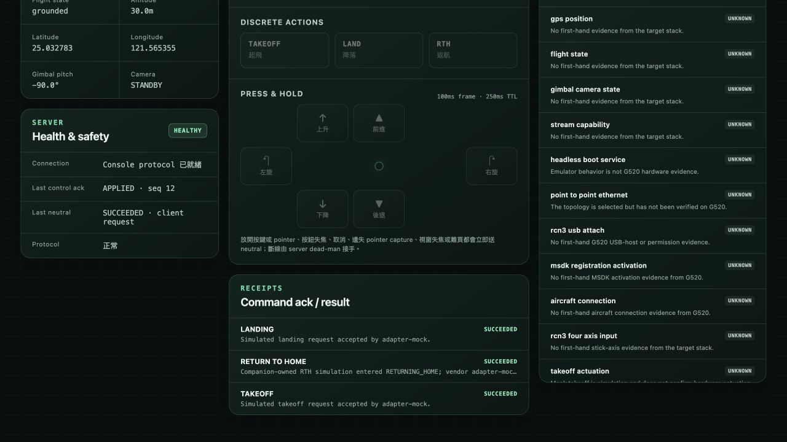
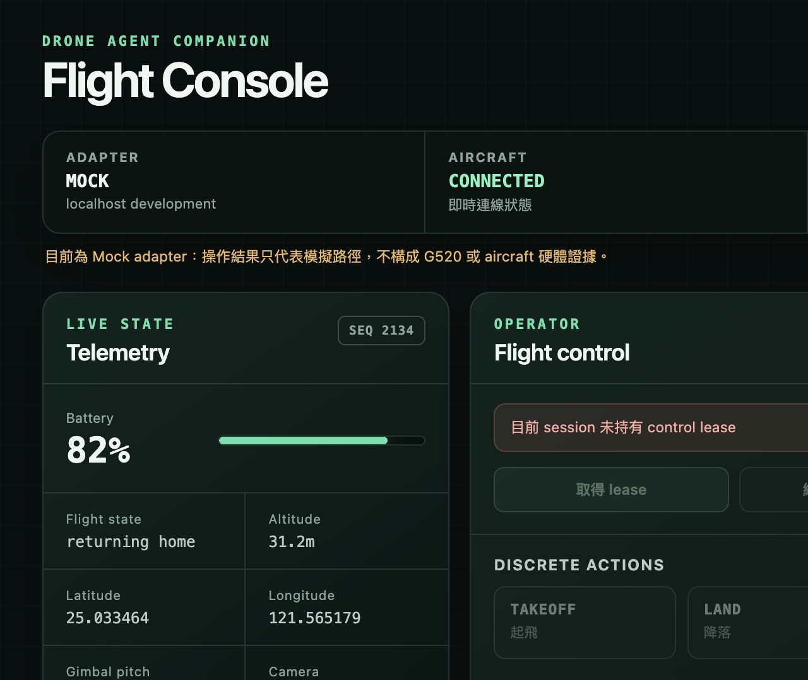

# Browser control runtime evidence — `2ed458f`

這份紀錄綁定受測 source commit
`2ed458f85d3ea4cd6b836e35aa09aaada1318ba5`。2026-08-16 以 Codex app 內建的
Chromium 瀏覽器連到 `http://127.0.0.1:18081` 的真實 `console-runner`／Ktor
WebSocket，runtime profile 為 `localhost-adapter-mock`。

## 可公開重查的結果

- UI 如實顯示 `MOCK`、`CONNECTED`，並明載 mock 結果不構成 G520 或 aircraft
  硬體證據。
- 取得 control lease 後，TAKEOFF、LANDING 與 RTH 都經頁內 modal 明確確認並收到
  terminal `SUCCEEDED`。RTH 文案明載為 companion-owned simulation，而不是 vendor
  adapter action。
- 六個 press-and-hold 方向各操作一次；audit 有 6 筆 `control_admitted` 與 6 筆
  `control_completed/applied`，每次 operator release 都有相符的 neutral
  requested/completed `succeeded`。
- 第二個 browser session 在第一個 session 持有 lease 時無法取得 lease。第一個 session
  關閉前先產生 `window_blur` neutral `succeeded`，斷線後 lease 以
  `client_disconnect` 釋放。
- canonical target-stack matrix 仍為 17/17 `UNKNOWN`，沒有 capability promotion。





機器可讀、無識別碼的統計與檔案 hash 在
[`browser-control-runtime-2ed458f.summary.json`](browser-control-runtime-2ed458f.summary.json)。
六向 exact axis mapping、每個 intent digest／authority correlation 與 structured audit 的
JVM 鑑別測試在
[`ConsoleRunnerEndToEndTest.kt`](../../console-runner/src/test/kotlin/com/durendal/droneagent/companion/console/runner/ConsoleRunnerEndToEndTest.kt)。

## Raw evidence 邊界

原始 JSONL 共 77 筆、31,030 bytes，capture 時間為
`2026-08-16T00:08:44Z` 至 `2026-08-16T00:13:13Z`，SHA-256：

```text
1e7178bbb702ef353b6f2bb09e0f06a931510349c064da33e587e39e864dd588
```

它含短效 session／lease identifiers，因此沒有提交到 public repo；capture 時僅放在已忽略的
`.drone-agent-companion/audit/`。公開 summary 只保留 event counts、unique-correlation counts、
terminal outcomes 與原始檔 hash，不保留識別碼本身。

## 證據天花板

本次最高狀態是 `RUNTIME_VERIFIED`，範圍僅限 Mac localhost browser +
`adapter-mock`。這不是 G520、RC-N3、Mini 4 Pro、DJI MSDK 或 aircraft actuation 證據；
不能用來關閉 issue #10、升級 capability matrix，或宣稱 `HARDWARE_VERIFIED`。
